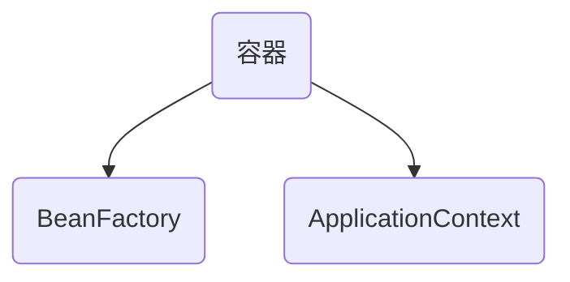

## 容器

Spring 提供了以下两种不同类型的容器。

| 序号 | 容器 & 描述                                                  |
| ---- | ------------------------------------------------------------ |
| 1    | [Spring BeanFactory 容器](https://www.w3cschool.cn/wkspring/j3181mm3.html)它是最简单的容器，给 DI 提供了基本的支持，它用 org.springframework.beans.factory.BeanFactory 接口来定义。BeanFactory 或者相关的接口，如 BeanFactoryAware，InitializingBean，DisposableBean，在 Spring 中仍然存在具有大量的与 Spring 整合的第三方框架的反向兼容性的目的。 |
| 2    | [Spring ApplicationContext 容器](https://www.w3cschool.cn/wkspring/yqdx1mm5.html)该容器添加了更多的企业特定的功能，例如从一个属性文件中解析文本信息的能力，发布应用程序事件给感兴趣的事件监听器的能力。该容器是由 org.springframework.context.ApplicationContext 接口定义。 |

ApplicationContext 容器包括 BeanFactory 容器的所有功能，所以通常建议超过 BeanFactory。BeanFactory 仍然可以用于轻量级的应用程序，如移动设备或基于 applet 的应用程序，其中它的数据量和速度是显著。、

##  ApplicationContext 容器

### 最常被使用的接口实现：

- **FileSystemXmlApplicationContext**：该容器从 XML 文件中加载已被定义的 bean。在这里，你需要提供给构造器 XML 文件的完整路径。
- **ClassPathXmlApplicationContext**：该容器从 XML 文件中加载已被定义的 bean。在这里，你不需要提供 XML 文件的完整路径，只需正确配置 CLASSPATH 环境变量即可，因为，容器会从 CLASSPATH 中搜索 bean 配置文件。
- **WebXmlApplicationContext**：该容器会在一个 web 应用程序的范围内加载在 XML 文件中已被定义的 bean。

## Spring Bean 定义

| 属性                     | 描述                                                         |
| ------------------------ | ------------------------------------------------------------ |
| class                    | 这个属性是强制性的，并且指定用来创建 bean 的 bean 类。       |
| name                     | 这个属性指定唯一的 bean 标识符。在基于 XML 的配置元数据中，你可以使用 ID 和/或 name 属性来指定 bean 标识符。 |
| scope                    | 这个属性指定由特定的 bean 定义创建的对象的作用域，它将会在 bean 作用域的章节中进行讨论。 |
| constructor-arg          | 它是用来注入依赖关系的，并会在接下来的章节中进行讨论。       |
| properties               | 它是用来注入依赖关系的，并会在接下来的章节中进行讨论。       |
| autowiring mode          | 它是用来注入依赖关系的，并会在接下来的章节中进行讨论。       |
| lazy-initialization mode | 延迟初始化的 bean 告诉 IoC 容器在它第一次被请求时，而不是在启动时去创建一个 bean 实例。 |
| initialization 方法      | 在 bean 的所有必需的属性被容器设置之后，调用回调方法。它将会在 bean 的生命周期章节中进行讨论。 |
| destruction 方法         | 当包含该 bean 的容器被销毁时，使用回调方法。它将会在 bean 的生命周期章节中进行讨论。 |

## Spring Bean 作用域scope

当在 Spring 中定义一个 bean 时，你必须声明该 bean 的作用域的选项。例如，为了强制 Spring 在每次需要时都产生一个新的 bean 实例，你应该声明 bean 的作用域的属性为 **prototype**。同理，如果你想让 Spring 在每次需要时都返回同一个bean实例，你应该声明 bean 的作用域的属性为 **singleton**。

Spring 框架支持以下五个作用域，分别为singleton、prototype、request、session和global session，5种作用域说明如下所示，

注意，如果你使用 web-aware ApplicationContext 时，其中三个是可用的。   

| 作用域         | 描述                                                         |
| -------------- | ------------------------------------------------------------ |
| singleton      | 在spring IoC容器仅存在一个Bean实例，Bean以单例方式存在，默认值 |
| prototype      | 每次从容器中调用Bean时，都返回一个新的实例，即每次调用getBean()时，相当于执行newXxxBean() |
| request        | 每次HTTP请求都会创建一个新的Bean，该作用域仅适用于WebApplicationContext环境 |
| session        | 同一个HTTP Session共享一个Bean，不同Session使用不同的Bean，仅适用于WebApplicationContext环境 |
| global-session | 一般用于Portlet应用环境，该运用域仅适用于WebApplicationContext环境 |

## Bean 定义模板和Bean继承

你可以创建一个 Bean 定义模板，不需要花太多功夫它就可以被其他子 bean 定义使用。在定义一个 Bean 定义模板时，你不应该指定**类**的属性，而应该指定带 **true** 值的**抽象**属性，如下所示：

```xml
<?xml version="1.0" encoding="UTF-8"?>

<beans xmlns="http://www.springframework.org/schema/beans"
    xmlns:xsi="http://www.w3.org/2001/XMLSchema-instance"
    xsi:schemaLocation="http://www.springframework.org/schema/beans
    http://www.springframework.org/schema/beans/spring-beans-3.0.xsd">

   <bean id="beanTeamplate" abstract="true">
      <property name="message1" value="Hello World!"/>
      <property name="message2" value="Hello Second World!"/>
      <property name="message3" value="Namaste India!"/>
   </bean>

   <bean id="helloIndia" class="com.tutorialspoint.HelloIndia" parent="beanTeamplate">
      <property name="message1" value="Hello India!"/>
      <property name="message3" value="Namaste India!"/>
   </bean>

</beans>
```

## 依赖注入

### 基于构造函数的注入


```xml
<?xml version="1.0" encoding="UTF-8"?>

<beans xmlns="http://www.springframework.org/schema/beans"
    xmlns:xsi="http://www.w3.org/2001/XMLSchema-instance"
    xsi:schemaLocation="http://www.springframework.org/schema/beans
    http://www.springframework.org/schema/beans/spring-beans-3.0.xsd">

   <!-- Definition for textEditor bean -->
   <bean id="textEditor" class="com.tutorialspoint.TextEditor">
      <constructor-arg ref="spellChecker"/>
   </bean>

   <!-- Definition for spellChecker bean -->
   <bean id="spellChecker" class="com.tutorialspoint.SpellChecker">
   </bean>

</beans>
```


#### 构造函数多参数：顺序编写

```
<beans>
   <bean id="foo" class="x.y.Foo">
      <constructor-arg ref="bar"/>
      <constructor-arg ref="baz"/>
   </bean>

   <bean id="bar" class="x.y.Bar"/>
   <bean id="baz" class="x.y.Baz"/>
</beans>
```


## Spring 基于设值函数的依赖注入

```xml
<?xml version="1.0" encoding="UTF-8"?>

<beans xmlns="http://www.springframework.org/schema/beans"
    xmlns:xsi="http://www.w3.org/2001/XMLSchema-instance"
    xsi:schemaLocation="http://www.springframework.org/schema/beans
    http://www.springframework.org/schema/beans/spring-beans-3.0.xsd">

   <!-- Definition for textEditor bean -->
   <bean id="textEditor" class="com.tutorialspoint.TextEditor">
      <property name="spellChecker" ref="spellChecker"/>
   </bean>

   <!-- Definition for spellChecker bean -->
   <bean id="spellChecker" class="com.tutorialspoint.SpellChecker">
   </bean>

</beans>
```

第二个你需要注意的点是，如果你要把一个引用传递给一个对象，那么你需要使用 标签的 **ref** 属性，而如果你要直接传递一个值，那么你应该使用 **value** 属性。

## 集合注入

```xml
<?xml version="1.0" encoding="UTF-8"?>

<beans xmlns="http://www.springframework.org/schema/beans"
    xmlns:xsi="http://www.w3.org/2001/XMLSchema-instance"
    xsi:schemaLocation="http://www.springframework.org/schema/beans
    http://www.springframework.org/schema/beans/spring-beans-3.0.xsd">

   <!-- Definition for javaCollection -->
   <bean id="javaCollection" class="com.tutorialspoint.JavaCollection">

      <!-- results in a setAddressList(java.util.List) call -->
      <property name="addressList">
         <list>
            <value>INDIA</value>
            <value>Pakistan</value>
            <value>USA</value>
            <value>USA</value>
         </list>
      </property>

      <!-- results in a setAddressSet(java.util.Set) call -->
      <property name="addressSet">
         <set>
            <value>INDIA</value>
            <value>Pakistan</value>
            <value>USA</value>
            <value>USA</value>
        </set>
      </property>

      <!-- results in a setAddressMap(java.util.Map) call -->
      <property name="addressMap">
         <map>
            <entry key="1" value="INDIA"/>
            <entry key="2" value="Pakistan"/>
            <entry key="3" value="USA"/>
            <entry key="4" value="USA"/>
         </map>
      </property>

      <!-- results in a setAddressProp(java.util.Properties) call -->
      <property name="addressProp">
         <props>
            <prop key="one">INDIA</prop>
            <prop key="two">Pakistan</prop>
            <prop key="three">USA</prop>
            <prop key="four">USA</prop>
         </props>
      </property>

   </bean>

</beans>
```

### 注入 Bean 引用

下面的 Bean 定义将帮助你理解如何注入 bean 的引用作为集合的元素。甚至你可以将引用和值混合在一起，如下所示：


```
<?xml version="1.0" encoding="UTF-8"?>

<beans xmlns="http://www.springframework.org/schema/beans"
    xmlns:xsi="http://www.w3.org/2001/XMLSchema-instance"
    xsi:schemaLocation="http://www.springframework.org/schema/beans
    http://www.springframework.org/schema/beans/spring-beans-3.0.xsd">

   <!-- Bean Definition to handle references and values -->
   <bean id="..." class="...">

      <!-- Passing bean reference  for java.util.List -->
      <property name="addressList">
         <list>
            <ref bean="address1"/>
            <ref bean="address2"/>
            <value>Pakistan</value>
         </list>
      </property>

      <!-- Passing bean reference  for java.util.Set -->
      <property name="addressSet">
         <set>
            <ref bean="address1"/>
            <ref bean="address2"/>
            <value>Pakistan</value>
         </set>
      </property>

      <!-- Passing bean reference  for java.util.Map -->
      <property name="addressMap">
         <map>
            <entry key="one" value="INDIA"/>
            <entry key ="two" value-ref="address1"/>
            <entry key ="three" value-ref="address2"/>
         </map>
      </property>

   </bean>

</beans>
```

## Spring基于注解的配置

## 基于注解的配置

从 Spring 2.5 开始就可以使用**注解**来配置依赖注入。而不是采用 XML 来描述一个 bean 连线，你可以使用相关类，方法或字段声明的注解，将 bean 配置移动到组件类本身。

在 XML 注入之前进行注解注入，因此后者的配置将通过两种方式的属性连线被前者重写。

注解连线在默认情况下在 Spring 容器中不打开。因此，在可以使用基于注解的连线之前，我们将需要在我们的 Spring 配置文件中启用它。所以如果你想在 Spring 应用程序中使用的任何注解，可以考虑到下面的配置文件。


```
<?xml version="1.0" encoding="UTF-8"?>

<beans xmlns="http://www.springframework.org/schema/beans"
    xmlns:xsi="http://www.w3.org/2001/XMLSchema-instance"
    xmlns:context="http://www.springframework.org/schema/context"
    xsi:schemaLocation="http://www.springframework.org/schema/beans
    http://www.springframework.org/schema/beans/spring-beans-3.0.xsd
    http://www.springframework.org/schema/context
    http://www.springframework.org/schema/context/spring-context-3.0.xsd">

   <context:annotation-config/>
   <!-- bean definitions go here -->

</beans>
```

一旦 被配置后，你就可以开始注解你的代码，表明 Spring 应该自动连接值到属性，方法和构造函数。让我们来看看几个重要的注解，并且了解它们是如何工作的：

| 序号 | 注解 & 描述                                                  |
| ---- | ------------------------------------------------------------ |
| 1    | [@Required](https://www.w3cschool.cn/wkspring/9sle1mmh.html)@Required 注解应用于 bean 属性的 setter 方法。 |
| 2    | [@Autowired](https://www.w3cschool.cn/wkspring/rw2h1mmj.html)@Autowired 注解可以应用到 bean 属性的 setter 方法，非 setter 方法，构造函数和属性。 |
| 3    | [@Qualifier](https://www.w3cschool.cn/wkspring/knqr1mm2.html)通过指定确切的将被连线的 bean，@Autowired 和 @Qualifier 注解可以用来删除混乱。 |
| 4    | [JSR-250 Annotations](https://www.w3cschool.cn/wkspring/lmsq1mm4.html)Spring 支持 JSR-250 的基础的注解，其中包括了 @Resource，@PostConstruct 和 @PreDestroy 注解。 |

## @PostConstruct 和 @PreDestroy 注释：

为了定义一个 bean 的安装和卸载，我们使用 **init-method** 和/或 **destroy-method** 参数简单的声明一下 。init-method 属性指定了一个方法，该方法在 bean 的实例化阶段会立即被调用。同样地，destroy-method 指定了一个方法，该方法只在一个 bean 从容器中删除之前被调用。